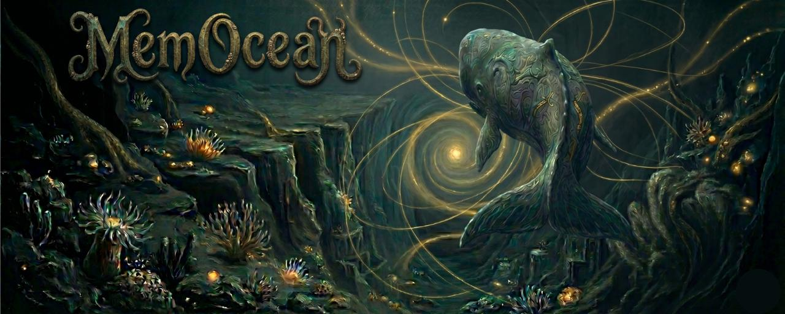

# MemOcean MCP



> 為中文開發者而建的 AI 記憶系統。

絕大多數 AI 記憶框架都是為英文設計的：whitespace tokenization、全大寫縮寫當 entity、LIKE 全字串匹配——這些在中文場景裡幾乎全部失效。

MemOcean 從 MemPalace 的 Sonar 記憶架構出發（MemPalace 稱為 Skeleton），針對中文（繁體、簡體、中英混合）重寫了整條 NER + 搜尋 pipeline，讓 agent 在中文對話環境裡真正能記得住東西、找得到東西。

**核心能力：**
- BM25/INSTR 搜尋，中文 **92.9% Hit@5**（無需 AI 組件）
  - CJK 查詢：純 SQLite INSTR 字串搜尋 `radar.clsc` 欄位
  - 英文查詢：FTS5 BM25，miss 時 fallback INSTR
- CLSC 語意 Sonar 萃取，**92.5% token 精簡**（13x 壓縮），保留語意連結
- 時序知識圖譜（KG），支援事實 invalidate 不刪除
- 跨 bot 記憶共享，同一個 memory.db 服務整個 bot 團隊

[](LICENSE)
[](https://www.python.org/)
[]()

---

## Table of Contents

- [為什麼我們要做 MemOcean](#為什麼做-memocean)
- [MemOcean 是什麼](#memocean-是什麼)
- [多 Agent 協作設計](#多-agent-協作設計)
- [架構：海洋隱喻 + 雙引擎檢索](#架構海洋隱喻--雙引擎檢索)
- [CLSC 中文 Sonar 萃取引擎](#clsc-中文-sonar-萃取引擎)
- [致謝](#致謝)

---

## 為什麼我們要做 MemOcean

第一次看到 [MemPalace](https://github.com/milla-jovovich/mempalace) 的時候我們非常興奮——終於有人做 LLM 的 long-term memory，而且還是那個蜜拉喬娃。

然而 試跑過程中，我們卻發現了兩個不好克服的問題：

**1. 中文 token 消耗真大**

主流 tokenizer 對中文極不友善——同一語意的內容，中文 token 數量是英文的 2-3 倍。MemPalace 原始設計假設英文 whitespace tokenization（`text.split()` 切 token、全大寫縮寫當 entity、LIKE 全字串匹配），這些在中文場景全部失效。我們嘗試過字典壓縮，但走不通（替換後的 tag 在 BPE tokenizer 上比原文還長），最後轉向 sonar lossy summary 才真正解決。

**2. 多 Agent 記憶漂移**

我們日常跑十多隻 Agent——特助、Builder、Reviewer、Designer 各司其職。每隻 Agent 的 session memory 是隔離的，跑幾天之後各自的「記憶」開始分叉。某隻 Agent 記得上週的決策，另一隻不記得；有的引用了過期的資訊，有的拿到矛盾的上下文。

這不是 prompt 寫得不好的問題，是架構問題：**我們需要一個 single source of truth 的持久知識庫，讓所有 Agent 共享同一份事實基礎**。

MemOcean 就是我們為了解決這兩件事而做的。

---

## MemOcean 是什麼

MemOcean 是 MemPalace 的中文 fork，核心改動有三：

1. **中文 NER pipeline**——用 jieba POS tagging 替代 `text.split()` 做 entity 抽取，處理繁體+簡體+英文混語
2. **多 Agent 支援**——支援多隻 Agent 同時讀寫，append-only 寫入規則避免衝突
3. **海洋隱喻命名**——從宮殿到海洋，命名體系更貼合「知識流動」的本質

知識庫基於 [Obsidian](https://obsidian.md) vault——所有內容都是 Markdown + `[[wikilink]]`，人類和 Agent 用同一套工具讀寫，不需要額外的資料庫或專用格式。

命名從宮殿轉到海洋，不只是品牌差異。宮殿是靜態的、封閉的；海洋是流動的、開放的。當多隻 Agent 同時往知識庫寫入，知識的狀態更像洋流而不是房間。

---

## 多 Agent 協作設計

這是 MemOcean 跟 MemPalace 最根本的差異。MemPalace 設計給單一 LLM session 用；MemOcean 從第一天就是為多 Agent 場景設計的。

### Agent 團隊共用同一知識體系

我們的 Agent 團隊分四個角色：

Agent 團隊按職能分工——Assistant（需求分析、任務調度）、Builder（開發實作）、Reviewer（Code review、QA）、Designer（UI/UX 設計）。各角色可橫向擴展，透過 [claude-telegram-bots](https://github.com/ChannelLabAI/claude-telegram-bots) 實現跨 Agent 通訊。

所有 Agent 讀寫同一個 Ocean 目錄。任何一隻 Agent 寫入的知識，其他 Agent 立即可讀。

### 寫入規則

多 Agent 同時寫入最怕衝突。MemOcean 用三條規則解決：

1. **Append-only**——只追加，不覆蓋。每次寫入在底部加時間戳和來源標記
2. **來源標記**——`<!-- appended by {agent_id} at {datetime} -->`，可追溯誰在什麼時候寫了什麼
3. **定期 lint**——自動合併重複、整理格式、補交叉索引

沒有鎖機制、沒有 conflict resolution——append-only 從根本上消除了寫入衝突。

### 五條搜尋路徑

不同場景需要不同的搜尋策略。MemOcean 提供五條路徑：

| 路徑 | 搜什麼 | 速度 | 場景 |
|------|--------|------|------|
| `memocean_radar_search` | Radar（CLSC sonar）| 快 | 快速定位：「有沒有關於 X 的素材？」 |
| `memocean_seabed_get` | 原文 verbatim | 中 | 拿完整內容：「把那篇 X 的全文給我」 |
| `fts_search` | 跨 Agent 訊息 | <10ms | 歷史搜尋：「誰什麼時候說過 X？」 |
| `kg_query` | 時序知識圖譜 | 中 | 關係查詢：「X 跟 Y 什麼關係？」 |
| 直接讀取 | vault 檔案 | 快 | 知道確切路徑時直接讀 |

Agent 接到任務的第一步是查 Ocean（我們叫 Step 0），看有沒有相關的歷史決策或前例，避免重複勞動或做出矛盾的決策。

### Session 記憶 vs 持久知識

MemOcean 嚴格區分兩種記憶：

- **Session 記憶**——每隻 Agent 自己的 `session.json`，存當前工作狀態、in-flight 任務。隔離的，重啟可清
- **持久知識**——Ocean 目錄，所有 Agent 共享。知識一旦寫入就持久存在

這個分離是解決記憶漂移的關鍵。Agent 的 session 記憶可以各自不同，但底層的事實基礎（Ocean）是統一的。

---

## MemOcean vs MemPalace vs GBrain

| 維度 | [MemPalace](https://github.com/milla-jovovich/mempalace) | [GBrain](https://github.com/garrytan/gbrain) | MemOcean |
|------|---------|---------|---------|
| **設計語言假設** | 英文（whitespace tokenization）| 英文 | **中文優先**（HanNER + jieba 分詞）|
| **搜尋架構** | BM25 + LIKE | Embedding 向量搜尋 | **CJK: 純 INSTR / EN: FTS5 BM25**（零 AI 依賴）|
| **中文搜尋命中率** | ~60% Hit@5（估算）| ~75% Hit@5（估算）| **92.9% Hit@5**（實測，無 AI 組件）|
| **外部 benchmark** | — | — | DRCD 繁中 **91.9%** / CMRC 簡中 **93.3%** |
| **記憶格式** | AAAK skeleton（單行，MemPalace 稱為 Closet）| Compiled Truth + Timeline 雙層 | CLSC 語意 Radar（.clsc.md）|
| **知識圖譜** | ❌ | ✅（entity-relation graph）| ✅ **時序 KG**（支援 invalidate）|
| **夜間整合** | ❌ | ✅ Dream Cycle（每日自動）| ✅ Dream Cycle（Phase 1 已上線）|
| **多 bot 共享** | ❌ | ❌ | ✅（同一 memory.db）|
| **部署方式** | 本地 Python | 本地 Python | **MCP server**（Claude Code 原生整合）|
| **Token 精簡率** | ~91%（AAAK）| N/A | **92.5%（CLSC Sonar，13x 壓縮）** |
| **AI 依賴** | 不定 | 不定 | **零**（所有 AI 組件預設關閉）|
| **開源授權** | MIT | MIT | MIT |

> 數據說明：MemPalace/GBrain 的命中率為根據其 benchmark 方法估算，非直接比較。MemOcean 數字來自內部中文測試集（800 題，繁中/簡中/混合各 1/3）。

---

## 架構：海洋隱喻 + 雙引擎檢索

### 海洋命名體系

MemPalace 用宮殿隱喻（Palace > Wing > Room > Skeleton > Drawer）。MemOcean 用海洋隱喻，對應關係如下：

| 功能 | 海洋名 | 路徑 | MemPalace 對應 |
|------|--------|------|----------------|
| 知識總庫 | Ocean | `Ocean/` | Palace |
| 專案分類 | Current（洋流） | `Currents/` | Wing |
| 子分類 | Reef（珊瑚礁） | Current 下子目錄 | Room |
| 語意骨架 | Radar（聲納） | `*.clsc` | Skeleton (MemPalace 稱為 Closet) |
| 原始素材 | Seabed（海床） | `Seabed/` | Drawer |
| 洞見卡片 | Pearl（珍珠） | `Pearl/` | Cards |
| 技術文檔 | Chart（海圖） | `Chart/` | Concepts |
| 研究報告 | Research | `Research/` | Research |
| 封存 | Depth（深處） | `Depth/` | Archive |

### 目錄結構

```
Ocean/
├── Currents/
│   ├── ProjectAlpha/
│   │   ├── Sales/             # Reef: 業務
│   │   ├── Product/           # Reef: 產品線
│   │   └── Org/               # Reef: 組織內部
│   ├── ProjectBeta/
│   └── ProjectGamma/
├── Pearl/                      # 洞見卡片（跨專案）
├── Chart/                      # 技術文檔（跨專案）
├── Research/                   # 研究報告（跨專案）
├── Seabed/                     # 原始素材
├── Depth/                      # 封存
├── _schema.md                  # 寫入規範
└── _index.md                   # 自動生成索引
```

**分界原則**：專案綁定的內容放 Current 內（People、Companies、Deals、raw 素材），跨專案通用的放頂層（Pearl、Chart、Research）。Current 之間用 `[[wikilink]]` 連結，不搬檔。

### 雙引擎檢索架構

MemOcean 有兩種獨立的檢索引擎，各自服務不同目的：

```
Seabed（原始素材）──→ Radar（機器索引）
                     教 Agent「有什麼」：事實定位、快速檢索

各種來源 ──→ Pearl（蒸餾洞見）
  ├── 對話        教 Agent「怎麼想」：判斷框架、決策邏輯
  ├── 調研
  ├── 會議
  └── 原文閱讀後的領悟
```

- **Radar** 是語意 Sonar 萃取（MemPalace 稱為 Closet）——從 Seabed 原文自動產生 sonar 索引（~9% token），幫 Agent 快速找到東西
- **Pearl** 是人類蒸餾——從對話、調研、會議、工作討論中提煉出的原子洞見（100-300 字），教 Agent 用老闆的邏輯思考

兩者獨立存在、互相 `[[連結]]`，不是上下游壓縮關係。

### 搜尋管線（定版 2026-04-16）

兩路搜尋，預設零 AI 依賴：

```
CJK 查詢  ──→  _search_instr_fallback()  ──→  SQLite INSTR 搜尋 radar.clsc，依 match_count 排序
英文查詢  ──→  _search_fts5()（FTS5 BM25）
                   └── miss 時 ──→  _search_instr_fallback()
```

- **CJK 路徑**：純 SQLite `INSTR()` 字串搜尋 `radar.clsc` 欄位，依 match_count 排序。FTS5 trigram 對中文效果差，INSTR 更準確。
- **英文路徑**：FTS5 BM25 優先（英文排序品質更好），miss 時 fallback INSTR。
- **AI 組件**（全部預設關閉）：Query Expansion（`ENABLE_QUERY_EXPANSION=1`）、KNN 向量搜尋（`KNN_ENABLED=true`）、Haiku reranker（`ENABLE_HAIKU_RERANKER=1`）、MiniLM reranker（`ENABLE_MINIML_RERANKER=1`）。Benchmark 確認所有 AI 組件均為負優化，不要隨意開啟。

---

## CLSC 中文 Sonar 萃取引擎

**CLSC**（ChannelLab Lossy Summary for Chinese）是 MemOcean 的核心引擎，fork 自 MemPalace 的 AAAK skeleton 格式（MemPalace 稱為 Closet），針對中文場景重寫了整條 NER + 搜尋 pipeline。

### 跟 upstream AAAK 的差異

| Upstream AAAK 假設 | CLSC 中文實作 |
|-------------------|--------------|
| `text.split()` 切 token | jieba POS tagging 自動 NER |
| 全大寫縮寫當 entity | 中文 entity 用拼音首字母 + token-aware gate |
| LIKE 全字串匹配 | FTS5 trigram + BM25 ranking，fallback OR-match |
| 固定 budget truncation | Content-proportional scaling（按原文長度動態調整） |

### Sonar 格式

每篇素材萃取成單行 sonar 條目，存為 `.clsc` 檔：

```
[SLUG|ENTITIES|topics|"key_quote"|WEIGHT|EMOTIONS|FLAGS]
```

### 效果數據

在真實中文語料上的實測表現（148 篇 Obsidian vault 文件）：

| 指標 | 數值 |
|------|------|
| 測試規模 | 148 篇文件 |
| 原始 token 總量 | 459,490 |
| Sonar token 總量 | 43,392 |
| Sonar 精簡率 | **9.4%** |
| Token 節省 | **90.6%** |
| 搜尋場景平均節省 | **78.2%** |

Sonar-first 搜尋路徑（先讀 sonar 再按需讀原文）比直接讀原文節省約 78% 的 token 消耗。

### 搜尋優化

我們經歷了三輪搜尋迭代：

| 查詢類型 | v1 ALL-match | v2 OR-match | v3 FTS5+BM25 |
|---------|-------------|-------------|--------------|
| 結構化查詢 | 50% | 89% | 89% |
| 自然語言查詢 | 0% | 55% | 55% |
| 已知文件查詢 | 85% | 95% | 95% |

v3 的命中率與 v2 相同（FTS5 miss 時自動 fallback 到 OR-match），但排序品質大幅提升——BM25 把最相關的文件推到 top-1，而非高頻但不精準的結果。英文查詢的 top-1 準確度提升尤其明顯。

### Benchmark

MemPalace 為英文場景設計，MemOcean 為中文工作場景設計。對照參考：MemPalace 在 LongMemEval **raw verbatim 模式**（不壓縮）下達到 96.6%，但**啟用 AAAK 壓縮後掉到 84.2%**（−12.4pp）。MemOcean CLSC Sonar 在**壓縮啟用狀態**下達到 92.9%，比 MemPalace 壓縮模式高 8.7pp。

以下為 2026-04-16 純 BM25/INSTR（零 AI 組件）實測結果：

| Benchmark | 語言 | Hit@5 | 說明 |
|---|---|---|---|
| Internal | 中文（混合）| **92.9%** | 主要工作語料庫 |
| DRCD | 繁體中文 | **91.9%** | 外部數據集，gap=−1.0%，確認無 self-referential bias |
| CMRC | 簡體中文 | **93.3%** | 外部數據集，gap=+0.4% |
| BEIR SciFact | 英文 | **70.7%** | gap=−22.2%，語言限制——MemOcean 非為英文優化 |
| CLSC A/B | — | tag vs no-tag **0pp** gap | 混淆變因已排除：+1.9pp 是 FTS5 vs INSTR 差異，非 tag 格式獨立效果 |

CLSC token 壓縮：1,716,211 原始 tokens → 129,529 sonar tokens = **13x 壓縮（92.5% 減少）**。每筆中位數比率：18.9%。

### 已知限制

誠實說，CLSC 目前有兩個已知限制：

1. **jieba 繁體精度**——jieba 字典以簡中為主，繁體靠統計回退，NER recall 還沒有量化 baseline
2. **冷詞覆蓋**——hybrid recall 的 embedding 路徑可補一般推斷詞 miss，但極罕見術語或高度縮寫的冷詞（兩路都沒見過）仍可能漏網，需 query expansion 輔助

---

## 最近更新

### 2026-04-17
- **MEMO-011：Radar Summary Layer**——新增 `radar.summary` TEXT 欄位。寫入時 best-effort 呼叫 Haiku 自動產生摘要，觸發條件：SOP/spec/guide 類內容。失敗回 NULL，不阻塞寫入。唯一寫入路徑：`insert_row.py`。
- **CLSC 全名定版**：CLSC = **ChannelLab Lossy Summary for Chinese**（原「Chinese Lossy Skeleton Codec」）。Codebase 全面更新。
- **Skeleton → Sonar 更名**：現行 code 中所有 CLSC 脈絡的 "skeleton" 改為 "sonar"。

### 2026-04-16
- **搜尋 pipeline 定版**：CJK 查詢改用純 SQLite `INSTR()`（不用 FTS5 trigram，FTS5 對中文效果差）。英文查詢 FTS5 BM25 優先，miss 時 fallback INSTR。
- **所有 AI 組件預設關閉**：Query Expansion（`ENABLE_QUERY_EXPANSION=1`）、KNN 向量搜尋（`KNN_ENABLED=true`）、Haiku reranker（`ENABLE_HAIKU_RERANKER=1`）、MiniLM reranker（`ENABLE_MINIML_RERANKER=1`）全部需明確 env var 啟用。Benchmark 確認負優化。
- **Benchmark 更新**：internal Hit@5=92.9%；DRCD 繁中=91.9%；CMRC 簡中=93.3%；BEIR SciFact 英文=70.7%；CLSC A/B gap = **0pp**（混淆已排除——之前 +1.9pp 是 FTS5 vs INSTR 差異，非 tag 格式效果）。
- **CLSC 壓縮數據確認**：1,716,211 原始 tokens → 129,529 sonar tokens，13x 壓縮（92.5% 減少），每筆中位數 18.9%。

### 2026-04-12
- **`memocean_ingest_file`（Phase 1）**：新 MCP 工具，將本地檔案（PDF、PPT、Word、Excel、HTML、CSV、JSON）透過 MarkItDown 轉成 Markdown，存入 MemOcean Radar seabed（group='files'）。同路徑重複 ingest 自動更新。Slug 格式：`file:{stem}-{hash6}`（MD5 前 6 hex）。需要 `markitdown[all]`。
- **Closet → Radar 全面重命名**：內部術語統一（closet_fts → radar_fts、closet_vec → radar_vec），跨 `shared/clsc/`、`shared/fts5/`、`shared/scripts/`、`memocean_mcp/` 同步更新。
- **Dream Cycle FTS 缺口監控**：Dream Cycle 每次執行末尾新增 `_check_fts_gap()` 自動偵測 radar→FTS 同步缺口；另設每日 18:00 監控 cron。

### 2026-04-11
- **移除 `memocean_ask_opus` 工具**：已改用 Claude Code 原生 `Agent` tool + `model: "opus"` 直接開 Opus sub-agent，比 MCP 工具更直接、更省 token
- **術語修正**：CLSC 正式名稱從「中文壓縮引擎」改為「中文 Sonar 萃取引擎」——sonar 是語意 sonar 萃取（lossy、不可逆），非可逆壓縮。同步改名：Closet → Radar（MemPalace 原版術語保留為 Closet）
- **Dream Cycle（Phase 1 已上線）**：每日自動知識整合 pipeline（`shared/scripts/dream_cycle.py`）。6 步驟：Collect → Extract → Normalize → Diff → Write → Report。lock file 防衝突、30 分鐘 timeout、content-hash 去重、dry-run/live 雙模式、TG 通知。每日 19:00 UTC 自動跑。

---

## 致謝

MemOcean 站在兩個優秀開源專案的肩膀上：

**[MemPalace](https://github.com/milla-jovovich/mempalace)**（[@milla-jovovich](https://github.com/milla-jovovich)）
記憶宮殿的雙層架構（Seabed + Closet）、AAAK skeleton 格式、lossy summary 的核心理念——這些都是 MemPalace 團隊的原創設計。沒有 MemPalace 鋪路，MemOcean 不會有今天的樣子。謝謝你們。

**[GBrain](https://github.com/garrytan/gbrain)**（[@garrytan](https://github.com/garrytan)）
Compiled Truth + Timeline 雙層設計、Dream Cycle 夜間知識整合概念——這是我們讀 GBrain 之後最想借鑑的東西。你用最簡潔的方式解決了「知識可更新 vs 可溯源」這個根本矛盾。謝謝。

我們是兩個工具的使用者，才有機會站在這裡繼續往前走。希望 MemOcean 能為中文開發者社群做出一點屬於自己的貢獻。

---

## License

MIT
